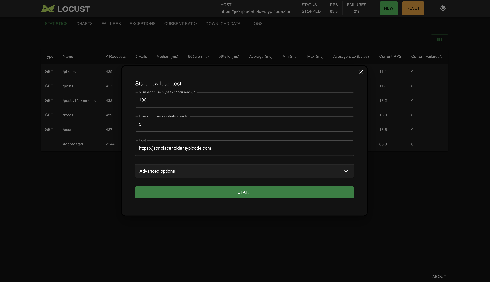
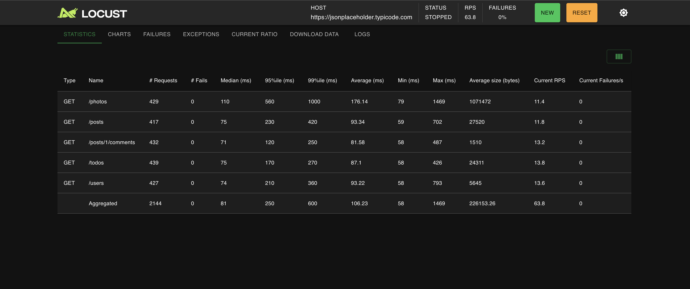
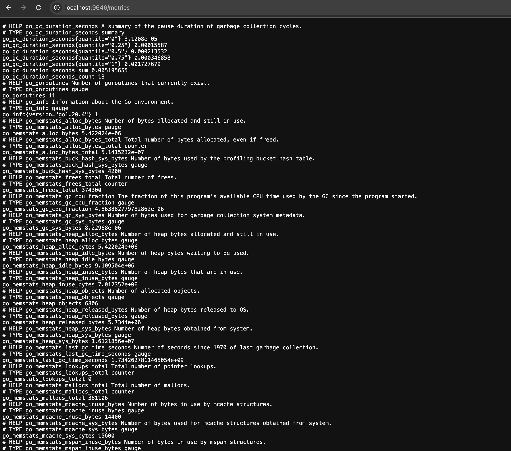
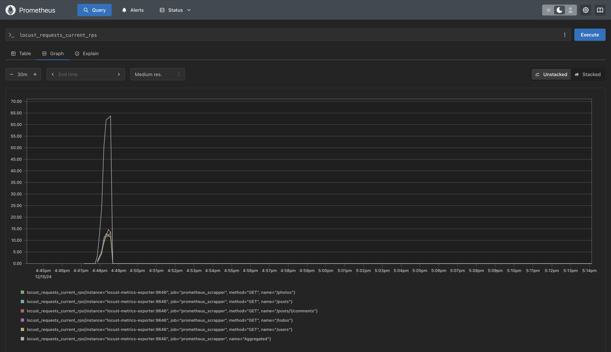
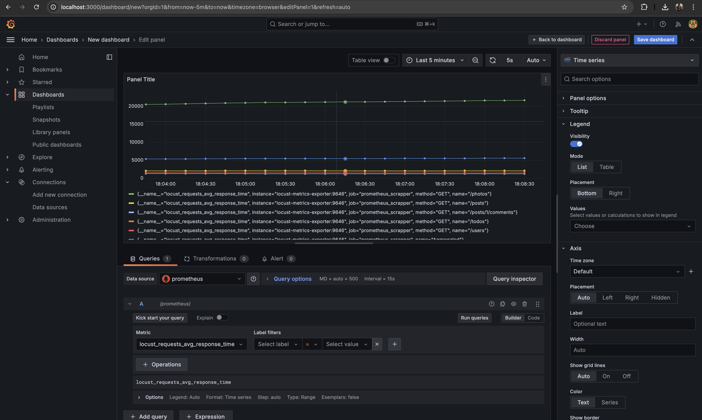

# Locust Grafana Stream Dashboard

[](https://www.docker.com/)
[](https://locust.io/)
[](https://grafana.com/)
[](https://prometheus.io/)

## Description

A complete containerized solution for real-time load testing visualization using Locust, Prometheus, and Grafana. This project provides a live streaming dashboard that displays performance metrics during load testing with automatic data collection and visualization.

## Architecture


## Features

- **Real-time Monitoring**: Live performance metrics during load testing
- **Containerized Setup**: Complete Docker Compose configuration
- **Pre-configured Dashboard**: Ready-to-use Grafana dashboard for Locust metrics
- **Scalable Architecture**: Easy to extend with additional test scenarios
- **Automated Data Pipeline**: Seamless data flow from Locust to Grafana

## Prerequisites

- Docker Desktop installed and running
- Docker Compose v2.0+
- 8GB+ RAM recommended
- Ports 3000, 8089, 9090, 9646 available

## Quick Start

1. **Clone the repository**
   ```bash
   git clone <repository-url>
   cd locustgrafanastream
   ```

2. **Start all services**
   ```bash
   docker-compose up -d
   ```

3. **Access the applications**
   - Locust Web UI: http://localhost:8089
   - Prometheus: http://localhost:9090
   - Grafana: http://localhost:3000 (admin/admin)
   - Metrics Endpoint: http://localhost:9646/metrics

## Project Structure

```
locustgrafanastream/
├── Dashboard/
│   └── dashboard.json          # Pre-configured Grafana dashboard
├── images/                     # Documentation screenshots
├── load_tests/
│   └── loadtest.py            # Locust test scenarios
├── prometheus/
│   └── prometheus.yml         # Prometheus configuration
├── docker-compose.yml         # Complete stack definition
└── README.md                  # This file
```

## About the Components

### Locust
Locust is an easy-to-use, scriptable and scalable performance testing tool. You define user behavior in regular Python code instead of using a clunky UI or domain-specific language. This project uses https://jsonplaceholder.typicode.com/ as the target API for demonstration.

### Test Configuration

The load test is defined in [`load_tests/loadtest.py`](load_tests/loadtest.py) with the following endpoints:

- `GET /posts` - Fetch all posts
- `GET /posts/1/comments` - Fetch comments for post 1
- `GET /photos` - Fetch all photos
- `GET /todos` - Fetch all todos  
- `GET /users` - Fetch all users

**Locust Service Configuration:**

```yaml
locust:
  image: locustio/locust
  ports:
    - "8089:8089"
  volumes:
    - ./load_tests/:/mnt/locust
  command: -f /mnt/locust/loadtest.py
```

After running the docker-compose up command, we access our locust panel from the specified port.



After entering our values ​​according to the metrics we mentioned here, we can run our test. These are x 
concurrent users, hatch rate of 1 user/s, and host. When we start the test, we can see that it works somehow without 
any errors.



Now we need to export the locust metrics for Grafana because you need to perform the metric flow between locust and 
Grafana with a real-time tool. In this article, we will do it with Prometheus. First, we will use the exporter that 
`ContainerSolution` has prepared as a locust-exporter. If you want to examine it in more detail, you can reach here and 
create a different exporter for yourself. As you can see below, we update docker-compose.yml again. This time we 
integrate the locust-exporter and define our local locust as the environment.

```docker
  locust-metrics-exporter:
    image: containersol/locust_exporter
    ports:
      - "9646:9646"
    environment:
      - LOCUST_EXPORTER_URI=http://locust:8089
    depends_on:
      - locust
```

And as always — run docker-compose up. We should be able to see metrics under 
http://localhost:9646/metrics.



Let’s look at how we integrate Prometheus and send these metrics.
First, we need to create a Prometheus config file and here we determine where and how many seconds you will receive the 
data. (prometheus.yml)

```yml
scrape_configs:
- job_name: prometheus_scrapper
  scrape_interval: 5s
  static_configs:
    - targets:
        - locust-metrics-exporter:9646
```
Then, we update our docker-compose.yml file and do the Prometheus integration as follows.

```docker
  prometheus:
    image: prom/prometheus:latest
    container_name: prometheus
    volumes:
      - ./prometheus/prometheus.yml:/etc/prometheus/prometheus.yml:ro  # Mount the config file
    ports:
      - "9090:9090"  # Expose Prometheus on port 9090
    command:
      - '--config.file=/etc/prometheus/prometheus.yml'  # Explicit config file path
    restart: unless-stopped
```
Now it’s time to see our metrics on Prometheus, we start our load test and check whether the metrics are Prometheus.



Once this is done we can now use prometheus as the data source to visualize the data using graphana. Now since graphana
is already available in as a docker image we will be using docker compose to pull the docker image.

```docker
grafana:
    image: grafana/grafana:latest
    container_name: grafana
    ports:
      - "3000:3000"
    volumes:
      - grafana_data:/var/lib/grafana
    environment:
      - GF_SECURITY_ADMIN=admin
      - GF_SECURITY_PASSWORD=admin
    restart: unless-stopped
volumes:
  grafana_data:  # Define the named volume here
```


