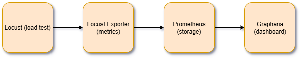

# Locust Grafana Stream Dashboard

[](https://www.docker.com/)
[](https://locust.io/)
[](https://grafana.com/)
[](https://prometheus.io/)

## Description

A complete containerized solution for real-time load testing visualization using Locust, Prometheus, and Grafana. This project provides a fully automated monitoring stack with pre-configured dashboards, data sources, and secure networking for comprehensive load testing analysis.

## Architecture



**Data Flow:**

```yml
Locust → Metrics Exporter → Prometheus → Grafana Dashboard
```

All services run in an isolated Docker network with automatic service discovery and configuration provisioning.

## ✨ Features

- **🚀 Zero-Configuration Setup**: Complete stack launches with a single command.
- **📊 Auto-Provisioned Dashboards**: Grafana dashboards and datasources configured automatically.
- **🔒 Secure Networking**: Isolated Docker network with proper service communication.
- **🔄 Real-time Monitoring**: Live performance metrics during load testing.
- **📈 Production-Ready**: Read-only containers with proper restart policies.
- **🎛️ Environment Variables**: Configurable admin credentials via environment variables.
- **🐳 Container Optimization**: Lightweight, secure container configurations.

## Prerequisites

- Docker Desktop installed and running
- Docker Compose v2.0+
- 8GB+ RAM recommended
- Ports 3000, 8089, 9090, 9646 available

## Quick Start

1. **Clone the repository**

   ```bash
   git clone <repository-url>
   cd locustgrafanastream
   ```

2. **Start all services**

   ```bash
   docker-compose up -d
   ```

3. **Access the applications**
   - Locust Web UI: <http://localhost:8089>
   - Prometheus: <http://localhost:9090>
   - Grafana: <http://localhost:3000> (admin/admin)
   - Metrics Endpoint: <http://localhost:9646/metrics>

## 🚀 Quick Start

1. **Clone and navigate to the project**

   ```bash
   git clone <repository-url>
   cd locustgrafanastream
   ```

2. **Start the complete monitoring stack**

   ```bash
   docker-compose up -d
   ```

3. **Access the applications**

   | Service | URL | Credentials |
   |---------|-----|-----------|
   | 🕷️ Locust Web UI | <http://localhost:8089> | N/A |
   | 📊 Grafana Dashboard | <http://localhost:3000> | admin/admin |
   | 🔍 Prometheus | <http://localhost:9090> | N/A |
   | 📈 Raw Metrics | <http://localhost:9646/metrics> | N/A |

4. **Start load testing**
   - Open Locust UI at <http://localhost:8089>
   - Set number of users and spawn rate
   - Target host is pre-configured to `jsonplaceholder.typicode.com`
   - Start the test and view real-time metrics in Grafana

## 📁 Project Structure

```yml
locustgrafanastream/
├── Dashboard/
│   ├── dashboard.json                 # Pre-configured Grafana dashboard
│   └── provisioning/
│       ├── dashboards.yml            # Dashboard auto-provisioning config
│       └── datasources.yml           # Prometheus datasource config
├── images/
│   ├── locustgraphanastream.drawio.png # Architecture diagram
│   └── *.png                         # Documentation screenshots
├── load_tests/
│   ├── loadtest.py                   # Locust test scenarios
│   └── __pycache__/                  # Python bytecode cache
├── prometheus/
│   └── prometheus.yml                # Prometheus scraping configuration
├── docker-compose.yml               # Complete stack definition
├── .gitignore                        # Git ignore rules
└── README.md                         # This documentation
```

## 🔧 Service Configuration

### Locust Load Tester

```yaml
locust:
  image: locustio/locust
  ports:
    - "8089:8089"
  volumes:
    - ./load_tests/:/mnt/locust
  command: -f /mnt/locust/loadtest.py
  networks:
    - monitoring
  restart: unless-stopped
  read_only: true
```

**Test Scenarios:**

- `GET /posts` - Fetch all posts
- `GET /posts/1/comments` - Fetch comments for a specific post
- `GET /photos` - Fetch all photos
- `GET /todos` - Fetch all todos
- `GET /users` - Fetch all users

### Metrics Exporter

```yaml
locust-metrics-exporter:
  image: containersol/locust_exporter
  ports:
    - "9646:9646"
  environment:
    - LOCUST_EXPORTER_URI=http://locust:8089
  depends_on:
    - locust
  networks:
    - monitoring
  restart: unless-stopped
  read_only: true
```

### Prometheus Time-Series Database

```yaml
prometheus:
  image: prom/prometheus:latest
  volumes:
    - ./prometheus/prometheus.yml:/etc/prometheus/prometheus.yml:ro
  ports:
    - "9090:9090"
  command:
    - '--config.file=/etc/prometheus/prometheus.yml'
  networks:
    - monitoring
  restart: unless-stopped
  read_only: true
```

**Scraping Configuration:**

- **Target**: `locust-metrics-exporter:9646`
- **Interval**: 5 seconds
- **Job Name**: `prometheus_scrapper`

### Grafana Visualization

```yaml
grafana:
  image: grafana/grafana:latest
  ports:
    - "3000:3000"
  volumes:
    - grafana_data:/var/lib/grafana
    - ./Dashboard/dashboard.json:/etc/grafana/provisioning/dashboards/dashboard.json:ro
    - ./Dashboard/provisioning/dashboards.yml:/etc/grafana/provisioning/dashboards/dashboards.yml:ro
    - ./Dashboard/provisioning/datasources.yml:/etc/grafana/provisioning/datasources/datasources.yml:ro
  environment:
    - GF_SECURITY_ADMIN=${GF_SECURITY_ADMIN:-admin}
    - GF_SECURITY_PASSWORD=${GF_SECURITY_PASSWORD:-admin}
  depends_on:
    - prometheus
  networks:
    - monitoring
  restart: unless-stopped
  read_only: true
```

## 📊 Dashboard Metrics

The pre-configured Grafana dashboard includes:

### Performance Metrics

- **Response Times**: Min, Max, Average, Median, P95, P50
- **Request Rate**: RPS per endpoint and total throughput
- **Content Analysis**: Average content length per endpoint

### Load Testing Metrics

- **User Simulation**: Active users, spawn rate, and test status
- **Request Statistics**: Total requests and request distribution
- **Error Analysis**: Failure rates, error counts, and error details

### System Health

- **Service Status**: Locust and exporter health indicators
- **Endpoint Performance**: Per-endpoint performance breakdown
- **Real-time Graphs**: Live updating time-series visualizations

## 🛠️ Customization

### Environment Variables

```bash
# Custom Grafana credentials
export GF_SECURITY_ADMIN=myusername
export GF_SECURITY_PASSWORD=mypassword
docker-compose up -d
```

### Modifying Load Tests

Edit [`load_tests/loadtest.py`](load_tests/loadtest.py):

```python
from locust import HttpUser, task, between

class CustomAPI(HttpUser):
    wait_time = between(1, 3)
    host = "https://your-api.com"

    @task
    def custom_endpoint(self):
        self.client.get("/your-endpoint")
```

### Adding Custom Dashboards

1. Create your dashboard in Grafana UI
2. Export JSON and place in `Dashboard/`
3. Update `Dashboard/provisioning/dashboards.yml` to include new dashboard

## 🔍 Monitoring and Debugging

### Health Checks

```bash
# Verify all services are running
docker-compose ps

# Check service logs
docker-compose logs locust
docker-compose logs prometheus
docker-compose logs grafana

# View metrics endpoint
curl http://localhost:9646/metrics
```

### Prometheus Targets

Visit <http://localhost:9090/targets> to verify:

- ✅ `locust-metrics-exporter:9646` is UP
- ✅ Scraping interval is 5s
- ✅ Last scrape was successful

### Grafana Data Source

The Prometheus data source is auto-configured with:

- **URL**: `http://prometheus:9090`
- **Access**: Server (default)
- **Scrape Interval**: 5s

## 🚨 Troubleshooting

### Common Issues

1. **Docker Desktop not running**

   ```bash
   # Verify Docker is running
   docker --version
   docker-compose --version
   ```

2. **Port conflicts**

   ```bash
   # Check for port conflicts (Windows)
   netstat -an | findstr "3000 8089 9090 9646"
   ```

3. **Services failing to start**

   ```bash
   # Check individual service logs
   docker-compose logs [service-name]

   # Restart specific service
   docker-compose restart [service-name]
   ```

4. **Dashboard not loading**
   - Verify Grafana is running: <http://localhost:3000>
   - Check Prometheus connectivity in Grafana → Data Sources
   - Ensure dashboard provisioning files are mounted correctly

5. **No metrics in dashboard**
   - Start a load test in Locust first
   - Verify metrics exporter: <http://localhost:9646/metrics>
   - Check Prometheus targets: <http://localhost:9090/targets>

### Reset Everything

```bash
# Stop and remove all containers, networks, and volumes
docker-compose down -v
docker-compose up -d
```

## 🏗️ Development

### Adding New Services

```yaml
# In docker-compose.yml
new-service:
  image: your-image
  networks:
    - monitoring
  restart: unless-stopped
  read_only: true
```

### Custom Prometheus Rules

Edit `prometheus/prometheus.yml` to add:

- New scrape targets
- Custom scrape intervals
- Additional monitoring endpoints

## 🤝 Contributing

Contributions are welcome! Please:

1. Fork the repository
2. Create a feature branch (`git checkout -b feature/amazing-feature`)
3. Make your changes
4. Add tests if applicable
5. Commit your changes (`git commit -m 'Add amazing feature'`)
6. Push to the branch (`git push origin feature/amazing-feature`)
7. Open a Pull Request

## 📏 License

This project is open source and available under the [MIT License](LICENSE).

## 🙏 Acknowledgments

- [Locust](https://locust.io/) - Modern load testing framework
- [Prometheus](https://prometheus.io/) - Time-series monitoring system
- [Grafana](https://grafana.com/) - Observability and visualization platform
- [ContainerSolutions](https://github.com/ContainerSolutions/locust_exporter) - Locust Prometheus Exporter

---

### Happy Load Testing! 🚀
